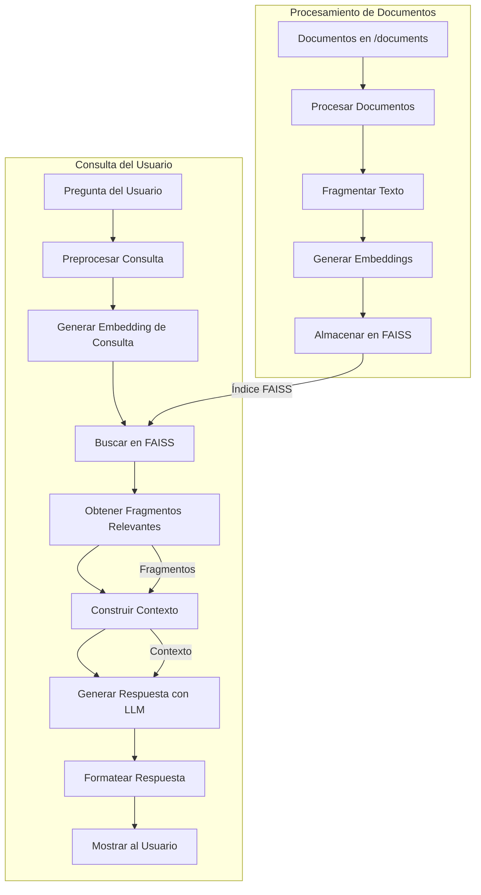

# 🤖 PocketFlow Assistant  

PocketFlow Assistant es un sistema avanzado de **recuperación y generación de respuestas (RAG)** que te permite interactuar con documentos de manera inteligente.  
Combina **búsqueda semántica** con **modelos de lenguaje** para ofrecer respuestas precisas basadas en tu información.  

---

## 📌 Tabla de Contenidos  
1. [Introducción](#-introducción)  
2. [Arquitectura del Sistema](#-arquitectura-del-sistema)  
3. [Requisitos del Sistema](#-requisitos-del-sistema)  
4. [Instalación y Configuración](#-instalación-y-configuración)  


---

## 🌟 Introducción  
Con PocketFlow Assistant podrás:  
- Consultar documentos en PDF, DOCX y TXT.  
- Obtener respuestas basadas en contenido real.  
- Mantener conversaciones con memoria de contexto.  
- Filtrar y personalizar parámetros de búsqueda.  

---

## 🏗️ Arquitectura del Sistema  

### 🔹 Procesamiento de Documentos (Offline)  
- Carga de documentos en múltiples formatos.  
- Fragmentación en chunks semánticos.  
- Generación de embeddings.  
- Almacenamiento en FAISS.  

### 🔹 Flujo de Consulta (Online)  
1. Normalización de la consulta.  
2. Búsqueda semántica en FAISS.  
3. Construcción de contexto.  
4. Generación de respuesta con LLM.  

## 📊 **Diagrama del flujo del sistema:**  




## 💻 Requisitos del Sistema
-Python 3.10 o superior

-Windows, macOS o Linux

-4 GB RAM mínimo (8 GB recomendados)

-Conexión a internet para descargar modelos y usar API

## 🛠️ Instalación y Configuración

Clona el repositorio:

```bash
git clone https://github.com/tu_usuario/pocketflow-assistant.git
cd pocketflow-assistant
```
Crear entorno virtual

```bash
python -m venv venv
# Windows
.\venv\Scripts\activate
# macOS/Linux
source venv/bin/activate
```
Instalar dependencias

```bash
pip install -r requirements.txt
```
Configurar variables de entorno
Crea un archivo .env con:

```env
OPENAI_API_KEY=tu_clave_aquí
EMBEDDING_MODEL=text-embedding-3-small
```

Iniciar el sistema

```bash
# Backend
uvicorn api:app --reload
# Interfaz
streamlit run ui.py
```


