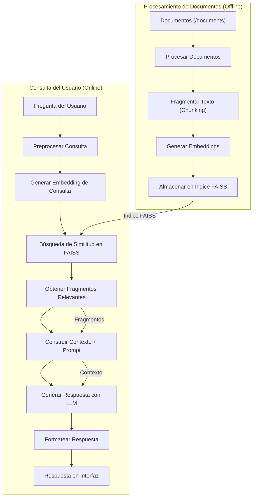
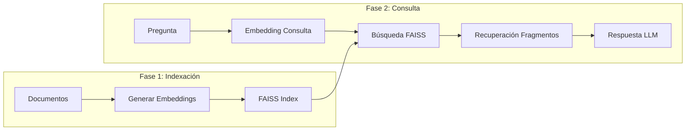

<div align="center">

# POCKETFLOW ASSISTANT
### Sistema Avanzado de Recuperación y Generación de Respuestas (RAG)

*Interactúa de forma inteligente con tu documentación local mediante búsqueda semántica vectorial y modelos de lenguaje de última generación.*

<br>

[](https://www.python.org/)
[](https://openai.com/)
[](https://github.com/facebookresearch/faiss)
[](https://streamlit.io/)

---

</div>

<br>

## Tabla de Contenidos

1. [Introducción](#introducción)
2. [Arquitectura del Sistema](#arquitectura-del-sistema)
3. [Requisitos del Sistema](#requisitos-del-sistema)
4. [Instalación y Configuración](#instalación-y-configuración)
5. [Diseño Técnico y Personalización](#diseño-técnico-y-personalización)

---

## Introducción

**PocketFlow Assistant** es una solución de arquitectura RAG (*Retrieval-Augmented Generation*) diseñada para procesar, indexar y consultar bases de conocimiento documentales de forma local y segura.

> **Funcionalidades Clave**
> * **Soporte Multiformato:** Ingesta e indexación de archivos PDF, DOCX y TXT.
> * **Búsqueda Semántica:** Recuperación de información relevante mediante vectores de *embeddings* almacenados en FAISS.
> * **Memoria de Contexto:** Generación de respuestas precisas conservando el hilo conversacional.
> * **Parámetros Ajustables:** Personalización de umbrales de similitud y tamaño de fragmentos (*chunks*).

---

## Arquitectura del Sistema

El sistema opera dividiendo el ciclo de vida de la información en dos fases principales:

#### 1. Procesamiento e Indexación (Offline)
- Carga de documentos desde el directorio de ingesta.
- Fragmentación del texto (*chunking*) basada en límites semánticos.
- Conversión de fragmentos a vectores densos mediante modelos de *embeddings*.
- Almacenamiento e indexación en la base de datos vectorial FAISS.

#### 2. Flujo de Consulta y Generación (Online)
- Normalización y preprocesamiento de la pregunta del usuario.
- Conversión de la consulta a vector de *embeddings*.
- Búsqueda de vecinos más cercanos (*k-NN*) en el índice FAISS.
- Extracción del contexto relevante y construcción del *prompt* para el LLM.
- Generación y formateo de la respuesta final.

### Diagrama de Flujo del Sistema


```mermaid
flowchart TD
    %% OFFLINE: INDEXACIÓN
    subgraph Offline["Procesamiento de Documentos (Offline)"]
        A["Documentos (/documents)"] --> B["Procesar Documentos"]
        B --> C["Fragmentar Texto (Chunking)"]
        C --> D["Generar Embeddings"]
        D --> E["Almacenar en Índice FAISS"]
    end

    %% ONLINE: CONSULTA
    subgraph Online["Consulta del Usuario (Online)"]
        F["Pregunta del Usuario"] --> G["Preprocesar Consulta"]
        G --> H["Generar Embedding de Consulta"]
        H --> I["Búsqueda de Similitud en FAISS"]
        I --> J["Obtener Fragmentos Relevantes"]
        J --> K["Construir Contexto + Prompt"]
        K --> L["Generar Respuesta con LLM"]
        L --> M["Formatear Respuesta"]
        M --> N["Respuesta en Interfaz"]
    end

    %% CONEXIÓN DE ÍNDICE
    E -->|Índice FAISS| I
    J -->|Fragmentos| K
    K -->|Contexto| L
```

---

## Requisitos del Sistema

| Requisito | Especificación Mínima | Recomendado |
| :--- | :--- | :--- |
| **Sistema Operativo** | Windows 10+, macOS, Linux | Linux / macOS |
| **Lenguaje** | Python 3.10 o superior | Python 3.11+ |
| **Memoria RAM** | 4 GB | 8 GB o superior |
| **Conectividad** | Acceso a Internet (APIs externas / Descarga de modelos) | Conexión de alta velocidad |

---

## Instalación y Configuración

### 1. Clonar el Repositorio
```bash
git clone https://github.com/tu_usuario/pocketflow-assistant.git
cd pocketflow-assistant
```

### 2. Crear y Activar Entorno Virtual

**En Windows (PowerShell):**
```powershell
python -m venv venv
.\venv\Scripts\activate
```

**En macOS / Linux:**
```bash
python3 -m venv venv
source venv/bin/activate
```

### 3. Instalar Dependencias
```bash
pip install --upgrade pip
pip install -r requirements.txt
```

### 4. Configurar Variables de Entorno
Cree un archivo `.env` en la raíz del proyecto basándose en el siguiente formato:

```env
OPENAI_API_KEY=tu_clave_api_aqui
EMBEDDING_MODEL=text-embedding-3-small
```

> **Nota de Seguridad:** Nunca incluya claves API reales en el control de versiones. Asegúrese de que el archivo `.env` esté incluido en `.gitignore`.

### 5. Ejecutar la Aplicación

**Servidor API (Backend):**
```bash
python api.py
```

**Interfaz Gráfica (Streamlit):**
```bash
streamlit run ui.py
```

---

## Diseño Técnico y Personalización

El comportamiento del motor RAG puede ajustarse modificando las variables de configuración principales:

| Parámetro | Descripción | Valor por Defecto |
| :--- | :--- | :--- |
| `EMBEDDING_MODEL` | Modelo de representación vectorial | `text-embedding-3-small` |
| `CHUNK_SIZE` | Tamaño del fragmento de texto en caracteres/tokens | `1000` |
| `CHUNK_OVERLAP` | Superposición entre fragmentos contiguos | `200` |
| `TOP_K` | Número de fragmentos más relevantes a recuperar | `4` |

### Flujo Simplificado de Datos


```mermaid
flowchart LR
    subgraph Indexación["Fase 1: Indexación"]
        A["Documentos"] --> B["Generar Embeddings"]
        B --> C["FAISS Index"]
    end

    subgraph Consulta["Fase 2: Consulta"]
        D["Pregunta"] --> E["Embedding Consulta"]
        E --> F["Búsqueda FAISS"]
        F --> G["Recuperación Fragmentos"]
        G --> H["Respuesta LLM"]
    end

    C --> F
```

