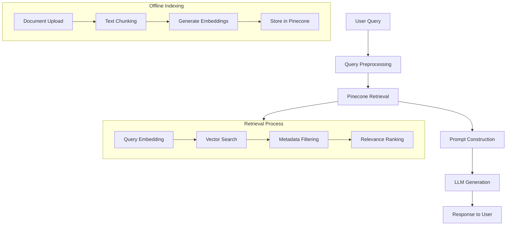

# Pocket Flow Assistant — RAG with Pinecone

## 1. Requirements

### Problem Statement
Build a chatbot assistant that mimics the behavior of the Pocket Flow Assistant GPT in ChatGPT, using domain-specific knowledge stored in Pinecone vector DB to support Retrieval-Augmented Generation (RAG).

### User Perspective
- **Primary User**: Developers and business users needing quick access to domain-specific knowledge
- **Core Need**: Get accurate, contextual answers about flow engines, business processes, and technical documentation
- **Success Criteria**: Assistant provides relevant, accurate responses with source attribution

### AI System Fit Assessment
- ✅ **Good fit**: Routine knowledge retrieval with well-defined inputs (user queries)
- ✅ **Good fit**: Creative synthesis of retrieved information into coherent responses
- ✅ **Strength**: Common sense reasoning over technical documentation

### Key Features (MVP)
1. **Document Upload & Embedding**: Process and store documents in Pinecone
2. **Semantic Search**: Retrieve relevant context chunks based on user queries
3. **Response Generation**: Generate contextual answers using retrieved knowledge
4. **Source Attribution**: Provide citations for retrieved information
5. **Fallback Handling**: Handle cases where knowledge is insufficient

## 2. Flow Design

### Design Pattern: RAG (Retrieval-Augmented Generation)
- **Offline Workflow**: Document ingestion, chunking, embedding, and indexing
- **Online Workflow**: Query processing, retrieval, prompt construction, and response generation

### High-Level Flow



### Node Descriptions

1. **Query Preprocessing**: Clean and normalize user input, extract intent
2. **Pinecone Retrieval**: Semantic search for top-k relevant document chunks
3. **Prompt Construction**: Combine user query with retrieved context using template
4. **LLM Generation**: Generate response using OpenAI/Anthropic models
5. **Response Formatting**: Format output with source citations and confidence indicators

### Map-Reduce Elements
- **Map**: Split documents into semantic chunks with metadata
- **Reduce**: Combine top-k retrieved chunks into coherent prompt context

## 3. Utilities

### External Utility Functions

#### Document Processing
- **`upload_document`** (`utils/document_processor.py`)
  - **Input**: File path, metadata dict
  - **Output**: List of text chunks with metadata
  - **Necessity**: Required for offline document ingestion

#### Embedding Generation
- **`generate_embeddings`** (`utils/embeddings.py`)
  - **Input**: List of text strings
  - **Output**: List of embedding vectors (1536 floats for ada-002)
  - **Necessity**: Convert text to vectors for semantic search

#### Pinecone Operations
- **`store_embeddings`** (`utils/pinecone_client.py`)
  - **Input**: Embeddings, metadata, IDs
  - **Output**: Success confirmation
  - **Necessity**: Store vectors in Pinecone index

- **`query_pinecone`** (`utils/pinecone_client.py`)
  - **Input**: Query vector, top_k, filters
  - **Output**: List of matched chunks with scores
  - **Necessity**: Retrieve relevant context for queries

#### LLM Integration
- **`call_llm`** (`utils/llm_client.py`)
  - **Input**: Prompt string, model parameters
  - **Output**: Generated response text
  - **Necessity**: Generate final responses using retrieved context

### Example Utility Implementation

```python
# utils/pinecone_client.py
import pinecone
from typing import List, Dict, Any

def query_pinecone(query_vector: List[float], top_k: int = 5, 
                  namespace: str = None, filter_dict: Dict = None) -> List[Dict]:
    """Query Pinecone for relevant chunks"""
    index = pinecone.Index("pocket-flow-assistant")
    
    results = index.query(
        vector=query_vector,
        top_k=top_k,
        namespace=namespace,
        filter=filter_dict,
        include_metadata=True
    )
    
    return [
        {
            "text": match.metadata.get("text", ""),
            "source": match.metadata.get("source", ""),
            "score": match.score
        }
        for match in results.matches
    ]
```

## 4. Data Schema

### Document Chunks (Pinecone Vectors)
```python
{
    "id": "doc_001_chunk_001",
    "values": [0.1, 0.2, ...],  # 1536-dim embedding vector
    "metadata": {
        "text": "Original chunk text content",
        "source": "document_name.pdf",
        "page": 1,
        "section": "Introduction",
        "chunk_index": 0,
        "timestamp": "2024-01-01T00:00:00Z",
        "doc_type": "technical_spec"
    }
}
```

### Query Request
```python
{
    "query": "How does the flow engine handle retries?",
    "top_k": 5,
    "filters": {
        "doc_type": "technical_spec",
        "section": ["engine", "retry"]
    },
    "namespace": "production"
}
```

### Response Format
```python
{
    "answer": "The flow engine handles retries by...",
    "sources": [
        {
            "text": "Retrieved chunk text",
            "source": "flow_engine_spec.pdf",
            "page": 15,
            "relevance_score": 0.89
        }
    ],
    "confidence": "high",
    "query_id": "uuid-string"
}
```

## 5. Node Implementation

### Core Nodes

#### 1. DocumentProcessor Node
```python
class DocumentProcessor:
    def process(self, file_path: str, metadata: Dict) -> List[Dict]:
        # Chunk document into semantic segments
        # Generate embeddings for each chunk
        # Return structured chunks with metadata
```

#### 2. Retriever Node
```python
class Retriever:
    def retrieve(self, query: str, top_k: int = 5) -> List[Dict]:
        # Generate query embedding
        # Search Pinecone index
        # Return ranked results with metadata
```

#### 3. PromptConstructor Node
```python
class PromptConstructor:
    def construct(self, query: str, context_chunks: List[Dict]) -> str:
        # Build prompt with system instructions
        # Include retrieved context
        # Format user query
```

#### 4. ResponseGenerator Node
```python
class ResponseGenerator:
    def generate(self, prompt: str) -> Dict:
        # Call LLM with constructed prompt
        # Parse and format response
        # Add source citations
```

## 6. Implementation Plan

### Phase 1: Core RAG Pipeline
1. Set up Pinecone index and OpenAI API integration
2. Implement document processing and embedding generation
3. Build basic retrieval and response generation
4. Create simple CLI interface for testing

### Phase 2: Enhanced Features
1. Add metadata filtering and namespace support
2. Implement source citation and confidence scoring
3. Add fallback handling for insufficient context
4. Create web API with FastAPI

### Phase 3: Production Features
1. Add streaming responses for better UX
2. Implement chat history and context memory
3. Build web UI with file upload capability
4. Add monitoring and analytics

### Tech Stack
- **Vector DB**: Pinecone
- **Embeddings**: OpenAI text-embedding-3-large
- **LLM**: OpenAI GPT-4o
- **Backend**: FastAPI
- **Frontend**: Streamlit (MVP) → React (Production)
- **Deployment**: Docker + Render/Vercel

## 7. Testing & Reliability

### Test Cases
1. **Document Ingestion**: Verify chunking and embedding quality
2. **Retrieval Accuracy**: Test semantic search with known queries
3. **Response Quality**: Evaluate answer relevance and accuracy
4. **Edge Cases**: Handle empty results, malformed queries, API failures
5. **Performance**: Test response times and concurrent usage

### Monitoring
- Query response times
- Retrieval relevance scores
- User satisfaction ratings
- API error rates and uptime

## 8. Success Metrics

### Technical Metrics
- **Retrieval Precision@5**: >80% relevant chunks in top 5 results
- **Response Time**: <3 seconds end-to-end
- **Uptime**: >99.5% availability

### User Experience Metrics
- **Answer Accuracy**: >85% user satisfaction
- **Source Attribution**: Citations provided for >90% of responses
- **Fallback Rate**: <10% "I don't know" responses

This design provides a solid foundation for building a production-ready RAG system that can effectively serve domain-specific knowledge through natural language interactions.
